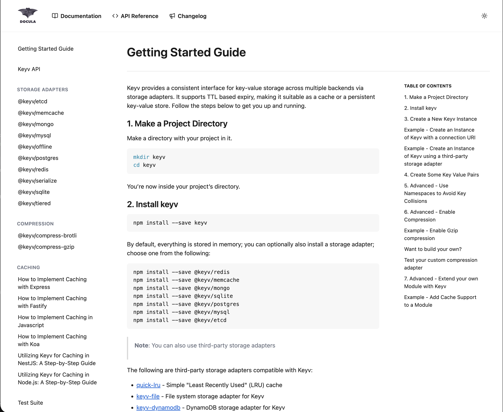
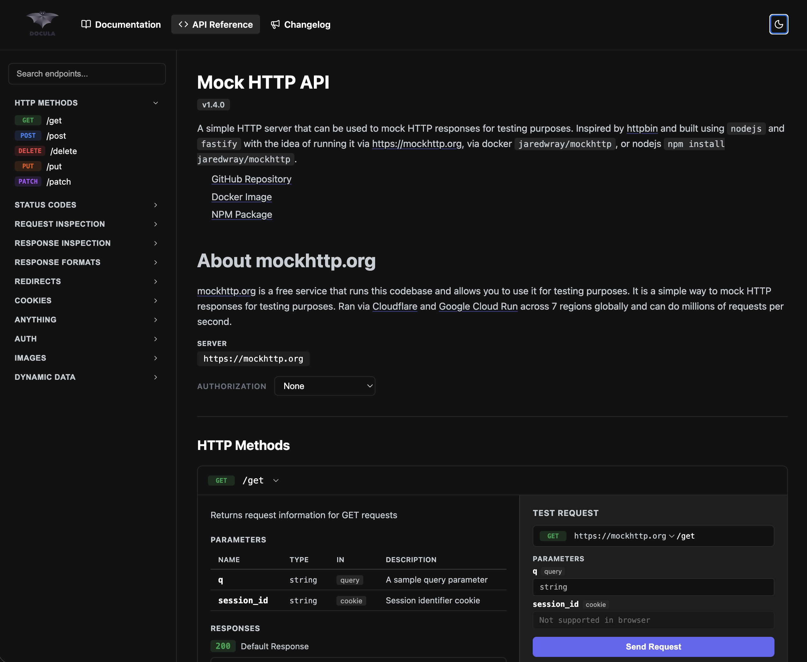
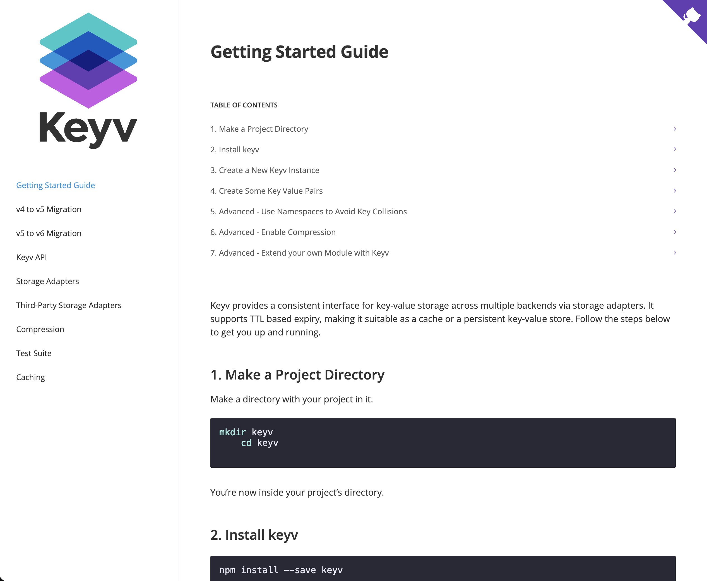

# Templates

Docula ships with two built-in templates: **Modern** (default) and **Classic**. You can also provide your own custom template.

## Modern (default)

The Modern template is a contemporary, feature-rich design built for today's documentation sites. It is the default template when you create a new Docula project.

```js
export const options = {
  template: 'modern',
};
```

### Documentation Page

Documentation pages use a sticky header bar with icon-based navigation links (Documentation, API Reference, Changelog), a collapsible left sidebar with grouped section navigation, a main content area, and a right-side Table of Contents panel. On mobile, the sidebar collapses into a dropdown selector.



### API Reference Page

When an OpenAPI URL is configured, the Modern template renders a full API reference with a left sidebar listing HTTP methods and endpoint categories, a main content area showing endpoint details with parameters and response codes, and an interactive "Test Request" panel on the right for trying endpoints directly in the browser.



### Key Features

| Feature | Details |
|---------|---------|
| **Theme toggle** | Built-in light/dark/system toggle stored in localStorage |
| **Mobile navigation** | Hamburger menu with slide-out sidebar and backdrop overlay |
| **Sticky header** | Always-visible navigation bar with Documentation, API Reference, and Changelog links |
| **Collapsible sidebar** | Uses `<details>` elements for expandable section navigation |
| **System fonts** | No external font dependencies (`system-ui`, `-apple-system`, etc.) |
| **Syntax highlighting** | Docula code theme with light and dark variants |
| **CSS variables** | Full theming via `--bg`, `--fg`, `--border`, `--surface`, `--link`, and more |

---

## Classic

The Classic template provides a traditional documentation layout inspired by popular open-source project sites. It uses a grid-based design with a prominent sidebar.

```js
export const options = {
  template: 'classic',
};
```

### Documentation Page

Documentation pages use a clean white layout with the project logo displayed prominently in the top-left corner, a flat left sidebar listing navigation links, and a main content area with an inline Table of Contents rendered at the top of the page. Code blocks use a dark theme for contrast.



### Key Features

| Feature | Details |
|---------|---------|
| **Grid layout** | Traditional two-column grid with sidebar and content area |
| **Google Fonts** | Uses Open Sans (weights 400, 600, 700) via Google Fonts |
| **Modular CSS** | Separate stylesheets for single-page, multi-page, and landing layouts |
| **Syntax highlighting** | Dracula code theme |
| **CSS variables** | Theming via `--color-primary`, `--color-secondary`, `--sidebar-background`, etc. |

---

## Comparison

| | Modern | Classic |
|---|--------|---------|
| **Theme toggle** | Built-in (light / dark / system) | Not included |
| **Mobile menu** | Hamburger with slide-out sidebar | Sidebar overlay |
| **Header navigation** | Sticky bar with SVG icons | Minimal |
| **Fonts** | System fonts (no external requests) | Google Fonts (Open Sans) |
| **Code theme** | Docula (light + dark) | Dracula |
| **Sidebar style** | Collapsible `<details>` sections | Flat list |
| **CSS architecture** | Single `styles.css` with variables | Modular per-layout files |

---

## Using a Custom Template

If neither built-in template fits your needs, you can point Docula at your own template directory. The directory should contain Handlebars (`.hbs`) files matching the structure of the built-in templates.

### Via config

```typescript
import type { DoculaOptions } from 'docula';

export const options: Partial<DoculaOptions> = {
  templatePath: './my-template',
};
```

### Via the CLI

```bash
npx docula build --templatePath ./my-template
```

When `templatePath` is set it takes priority over the `template` option. Your custom template directory should include at minimum:

- `home.hbs` — Landing page
- `docs.hbs` — Documentation page
- `includes/` — Partials (header, footer, sidebar, etc.)

Refer to the built-in templates in the `templates/` directory of the Docula repository for a complete example of the expected structure and available Handlebars variables.
